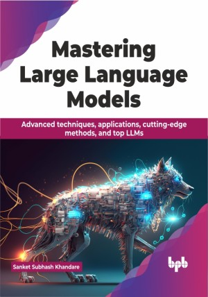

# Mastering Large Language Models

Do not just talk AI, build it: Your guide to LLM application development

This is the repository for [Mastering Large Language Models
](https://bpbonline.com/products/mastering-large-language-models?variant=43308510216392),published by BPB Publications.

## About the Book
Transform your business landscape with the formidable prowess of large language models (LLMs). The book provides you with practical insights, guiding you through conceiving, designing, and implementing impactful LLM-driven applications.

This book explores NLP fundamentals like applications, evolution, components and language models. It teaches data pre-processing, neural networks, and specific architectures like RNNs, CNNs, and transformers. It tackles training challenges, advanced techniques such as GANs, meta-learning, and introduces top LLM models like GPT-3 and BERT. It also covers prompt engineering. Finally, it showcases LLM applications and emphasizes responsible development and deployment. 

With this book as your compass, you will navigate the ever-evolving landscape of LLM technology, staying ahead of the curve with the latest advancements and industry best practices.

## What You Will Learn
• Grasp fundamentals of natural language processing (NLP) applications.

• Explore advanced architectures like transformers and their applications.

• Master techniques for training large language models effectively.

• Implement advanced strategies, such as meta-learning and self-supervised learning.

• Learn practical steps to build custom language model applications.
